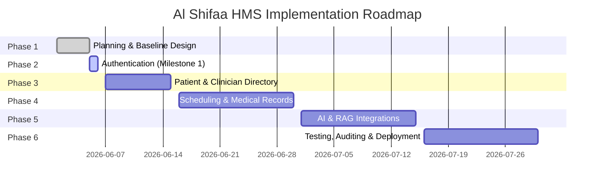

# Project Charter: Al Shifaa HMS (AI-Powered Hospital Management System)

---
**Metadata**
- **Author:** Senior Developer & Architect
- **Status:** APPROVED (Milestone 1 Completed)
- **Target Audience:** Engineering, Product, Healthcare Operations Stakeholders
- **Last Updated:** June 6, 2026
---

## 1. Project Vision & Purpose

### 1.1 Executive Summary
The Al Shifaa HMS (AI-Powered Hospital Management System) is an enterprise-grade, full-stack medical software solution designed to centralize, secure, and optimize clinic and hospital operations. By integrating modern software architecture patterns with secure Role-Based Access Control (RBAC) and Artificial Intelligence capabilities, Al Shifaa HMS streamlines the operational workflow for administrators, clinicians, operational staff, and patients.

### 1.2 Core Problem Statement
Healthcare facilities often suffer from fragmented software environments, data silos, and administrative bottlenecking:
- **Relational Duplication:** Administrative overhead, scheduling conflicts, and unsynchronized medical records.
- **Cognitive Load:** Clinicians spend excessive time parsing large volumes of historical patient documentation rather than focused patient care.
- **Access Gaps:** Patients face friction booking sessions and reviewing their own medical summaries securely.
- **Security Deficits:** Failure to comply with strict HIPAA-aligned data privacy standards due to legacy access controls.

### 1.3 Project Goal
To construct a modern, scalable, secure, and compliant SPA-API platform that acts as a central registry for clinic workflows, powered by client-side and server-side role-based authentication, and augmented with local LLM capabilities (via RAG) to assist clinicians in decision making.

---

## 2. Project Scope

### 2.1 In Scope (Phase 1 / Version 1)
- **Identity & Access Management:** Stateless JWT-based authentication, token rotation, automated access token refreshing, and custom RBAC permission gates.
- **Patient Management:** Medical Record Number (MRN) indexing, profiles, and basic demographics.
- **Clinical Directory:** Doctor specialties, availability calendars, and profile sheets.
- **Workflow Scheduling:** Appointment booking, resource reservation, and patient check-in.
- **Clinical Records:** Electronic Health Record (EHR) persistence, diagnostic summaries, and prescription writing.
- **Intelligent Assistant:** RAG-powered chatbot utilizing localized patient records to synthesize clinical notes.

### 2.2 Out of Scope (Version 1)
- **Telemedicine:** Real-time video conferencing or remote patient monitoring.
- **Billing & Insurance:** Claim validation, payment gateway checkouts, and insurance provider portals.
- **IoT Integration:** Direct communication with medical hardware devices (e.g., patient monitors, ventilators).
- **Multi-Tenant Hub:** Supporting multiple independent hospital entities on a single database instance.

---

## 3. Product Roadmap & Phases

---

## 4. Stakeholders & Personas

| Persona | Access Tier | Primary Workflows |
|:---|:---|:---|
| **Administrator (`ADMIN`)** | Global Read/Write | System configuration, database backups, audit trail reviews, user provisioning. |
| **Doctor (`DOCTOR`)** | Clinical Read/Write | Accessing patient medical histories, clinical summaries, writing prescriptions. |
| **Receptionist (`RECEPTIONIST`)** | Operational Read/Write | Booking sessions, check-in validation, patient onboarding, editing schedules. |
| **Patient (`PATIENT`)** | Self Read/Restricted Write | Booking appointments, reviewing personal records, updating personal contacts. |

---

## 5. Technology Stack Selection

### 5.1 Frontend Architecture
- **Framework:** React 19 (Single Page Application)
- **Build Tool:** Vite 8
- **Design Language:** Google Material Design 3 (M3) via MUI v9
- **Typeface:** Outfit Font
- **State Management:** React Context API (Global Auth State Provider)
- **HTTP Client:** Axios (Queue-based token refresh interceptors)

### 5.2 Backend Services
- **Framework:** Django REST Framework (DRF) 3.17+
- **Python Version:** Python 3.11
- **Database Engine:** PostgreSQL 15+ (Production) / SQLite (Automated testing fallback)
- **Authentication:** DRF-SimpleJWT (Stateless Access/Refresh Token rotation)

---

## 6. Success Metrics & Standards

- **Security Compliance:** 100% of non-public API endpoints locked behind role-based permission classes. Zero plain-text passwords stored (all hashed via bcrypt/Argon2).
- **Session Continuity:** Seamless UX where users do not experience session drops; automatic background JWT refresh must execute in <250ms.
- **Latency SLAs:** Database lookup, credentials check, and token response completed within <500ms.
- **Visual Integrity:** Absolute compliance with Material Design 3 spacing and styling principles. Fully responsive layouts.
