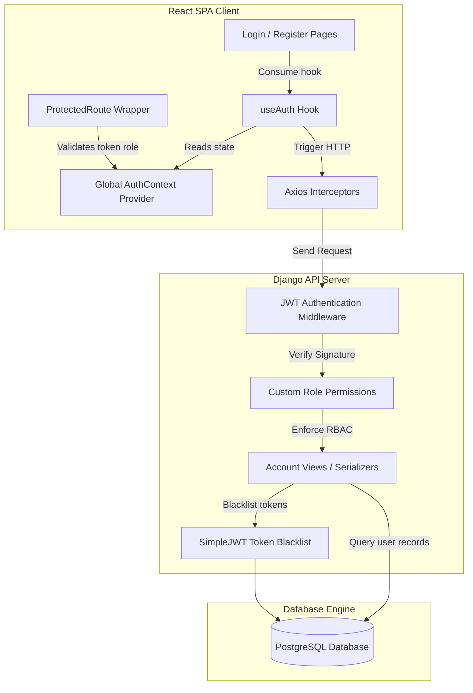
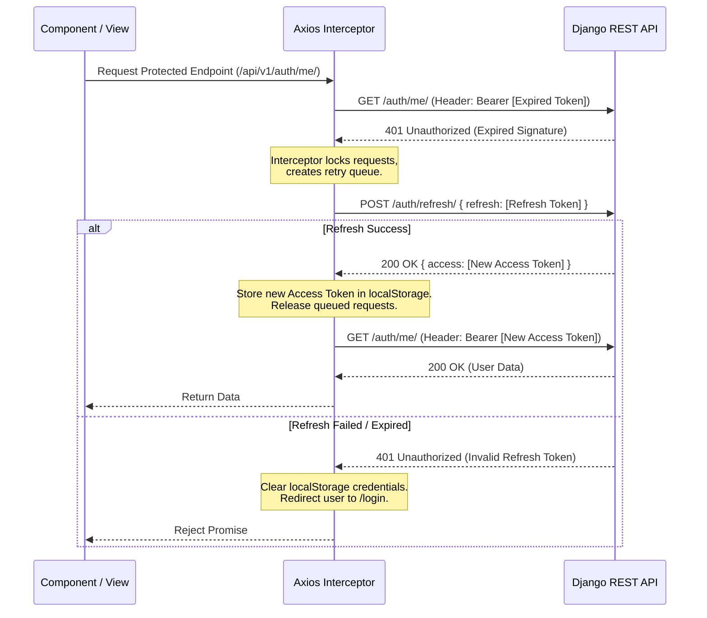

# System Architecture Design: Authentication & Access Control

---
**Metadata**
- **Document Version:** 1.0 (Milestone 1 Completed)
- **Target Audience:** System Architects, Backend Developers, Security Reviewers
- **Status:** APPROVED
---

## System Authentication & Security Philosophy

> **Al Shifaa HMS follows claim-based identity with server-side role resolution, zero trust request validation, RBAC permission enforcement, and controlled onboarding — users prove identity, the system determines access.**

### Identity-Driven UI
There is one login page for everyone — doctor, receptionist, admin, nurse, pharmacist, patient. No dropdowns, no role selection, no separate URLs for different staff. Just email and password (or Google SSO). After authentication, the server-issued JWT token contains the role claim. The frontend reads it and renders the correct dashboard. For example, a receptionist sees the reception dashboard, a doctor sees the doctor dashboard, and an admin sees everything. The server determines the layout based on who the user is.

### Controlled Onboarding (Provisioning vs Self-Registration)
As an enterprise Hospital Management System, Al Shifaa HMS implements a provisioning-assisted flow rather than open self-registration. Clinical staff (such as doctors and nurses) apply for accounts, and an administrator provisions/activates them with the appropriate role and department.

## 1. System Topology & Layers

The system is structured as a decoupled Single Page Application (SPA) communicating with a stateless REST API backend. 

```
┌─────────────────────────────────────────────────────────────────┐
│                    Frontend (React 19 / Vite)                   │
│                                                                 │
│   ┌────────────────────┐   ┌──────────────┐   ┌─────────────┐   │
│   │    Mui M3 UI       │   │  useAuth()   │   │ AuthContext │   │
│   │ (LoginForm, etc.)  │──>│ Custom Hook  │──>│ Global State│   │
│   └────────────────────┘   └──────────────┘   └─────────────┘   │
│                                                      │          │
│                                                      ▼          │
│                                               ┌─────────────┐   │
│                                               │ Axios Client│   │
│                                               │(Interceptors│   │
│                                               └─────────────┘   │
└──────────────────────────────────────────────────────│──────────┘
                                                       │ HTTPS (Bearer Token)
                                                       ▼
┌─────────────────────────────────────────────────────────────────┐
│               Backend Services (Django DRF / Python)            │
│                                                                 │
│   ┌────────────────────┐   ┌──────────────┐   ┌─────────────┐   │
│   │    WSGI / URL      │   │  SimpleJWT   │   │ Custom DRF  │   │
│   │    Routing         │──>│Middleware Gate│──>│ Permissions │   │
│   └────────────────────┘   └──────────────┘   └─────────────┘   │
│                                                      │          │
│                                                      ▼          │
│                                               ┌─────────────┐   │
│                                               │ Django ORM  │   │
│                                               └─────────────┘   │
└──────────────────────────────────────────────────────│──────────┘
                                                       │ Database Connection
                                                       ▼
┌─────────────────────────────────────────────────────────────────┐
│                         Database Layer                          │
│                                                                 │
│                 ┌─────────────────────────────┐                 │
│                 │      PostgreSQL (Neon)      │                 │
│                 │ (SQLite in testing context) │                 │
│                 └─────────────────────────────┘                 │
└─────────────────────────────────────────────────────────────────┘
```

---

## 2. Component Diagram



---

## 3. Core Interaction Workflows

### 3.1 Login & Token Issuance Flow
1. **Submission:** User enters email and password.
2. **Server Check:** Backend validates credentials using the `CustomTokenObtainPairSerializer` class.
3. **Payload Construction:** The backend returns an Access Token (15-minute expiration) and a Refresh Token (7-day expiration).
4. **Extra Body Data:** The login API response contains the `role`, `email`, `must_complete_profile`, and `user` profile data directly in the JSON response payload.
5. **State Initialization:** The React `AuthContext` initializes the session, stores the access token in memory/state, sets the refresh token as an HTTPOnly SameSite=Strict cookie, and populates the global `user` state.

---

### 3.2 Google SSO & Profile Completion Flow
1. **Google Login:** User clicks Google sign-in button. Google Client SDK issues an ID Token/Access Token.
2. **Backend Verify:** The client POSTs the token to `/api/v1/auth/google/`.
3. **JWT Extraction:** Backend calls google-auth libraries to verify the token signature, extract `email` and `sub`.
4. **User Lookup & Account Association:**
   - If user exists with the email and `google_sub` is empty, backend saves the `google_sub` to link accounts.
   - If user does not exist, backend returns a `403 Forbidden` response (`not_registered`). Only existing accounts can sign in via Google.
5. **Profile Completion:** If user is missing core details (like a department for clinical staff), the backend sets `must_complete_profile = true` in the token. The frontend `ProtectedRoute` intercepts this and forces redirection to `/auth/complete-profile` to collect department, employee ID, and phone number before proceeding.

---

### 3.3 Password Reset OTP Flow
1. **Request Code:** User submits email to `/api/v1/auth/forgot-password/`.
2. **OTP Generation:** Django generates a random 6-digit code, saves a `PasswordResetOTP` record with a 10-minute expiry, and emails the code.
3. **OTP Verification:** User inputs the code to the frontend. The client POSTs email and code to `/api/v1/auth/verify-otp/`.
4. **One-Time Token:** If valid, the backend marks the OTP as used and returns the OTP record `id` as a secure session token.
5. **Password Reset:** The client POSTs the new password and the OTP record ID to `/api/v1/auth/reset-password/` to update the password.

---

### 3.4 Staff Invite-Driven Registration Flow
1. **Invite Generation:** An Admin creates a `StaffInvite` record specifying email, role, and department.
2. **Onboarding URL:** The invite link contains a unique UUID token pointing to the register page.
3. **Token Verification:** The frontend calls `/api/v1/auth/validate-invite/` to check the link's validity and extract the invited email and role.
4. **Form Lock:** The registration form locks the email and role to match the invitation.
5. **Registration:** The staff member fills in their password and full name. The backend registers the user and invalidates the invitation.

---

### 3.5 Automated Token Refresh Flow (Axios Queue Interceptor)
When an access token expires, client requests fail with an HTTP 401 response code. The Axios client automatically handles recovery:



---

## 4. Database Context Switching (Testing vs. Production)

To bypass internet latency and connection timeout issues during automated verification sprints:
- **Production/Local Dev:** Standard database queries go directly to the PostgreSQL database hosted on Neon.
- **Testing (`python manage.py test`):** A custom settings hook detects the test script args and switches the default database engine to `django.db.backends.sqlite3` on a local file block, avoiding any outbound cloud connections.

```python
import sys
if 'test' in sys.argv:
    DATABASES['default'] = {
        'ENGINE': 'django.db.backends.sqlite3',
        'NAME': BASE_DIR / 'db.sqlite3',
    }
```
This is fully compliant with modern developer practices for serverless backend engines.
