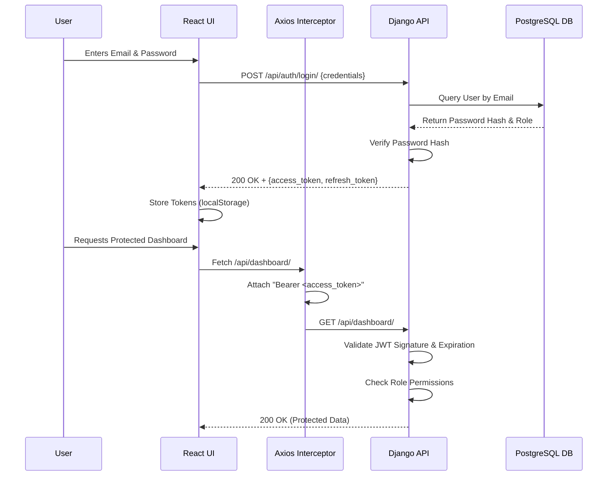
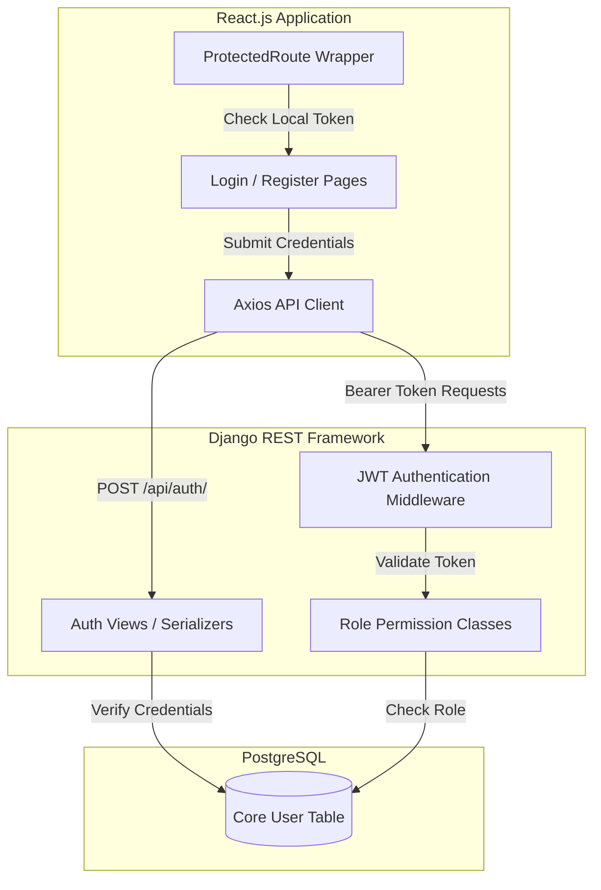

# System Design Document: Authentication & Authorization

**Project:** AI Hospital Management System (AI-HMS)  
**Milestone:** 01 - Authentication & Authorization  
**Technologies:** React.js, Django REST Framework, PostgreSQL, JWT  

---

## 1. Authentication Architecture
The authentication architecture is completely stateless, leveraging JSON Web Tokens (JWT). When a user successfully authenticates via the `/api/auth/login/` endpoint, the Django backend issues an Access Token (short-lived) and a Refresh Token (long-lived). The React frontend stores these tokens securely (e.g., memory/localStorage for Milestone 1, transitioning to HttpOnly cookies for production) and attaches the Access Token as a Bearer token in the `Authorization` header of all subsequent API requests.

## 2. Authorization Architecture
Authorization is strictly Role-Based Access Control (RBAC). The backend enforces authorization at the view level using Django REST Framework's permission classes (e.g., `IsAdminUser`, `IsDoctor`, `IsPatient`). The JWT contains the user's role payload, allowing the frontend to quickly decode the token and render or hide UI elements without requiring an extra database lookup. However, the ultimate source of truth remains the backend, which verifies the token signature and the user's role against the requested resource.

## 3. JWT Flow
1. **Login Request:** Client sends `email` and `password`.
2. **Verification:** Backend verifies credentials against the PostgreSQL database using bcrypt hashing.
3. **Token Generation:** Backend generates a JWT containing the user's `user_id` and `role`.
4. **Token Storage:** Frontend stores the Access Token and Refresh Token.
5. **Authenticated Request:** Frontend attaches the Access Token to the `Authorization: Bearer <token>` header.
6. **Token Refresh:** When the Access Token expires (HTTP 401), the frontend uses the Refresh Token to request a new Access Token via `/api/auth/refresh/`.

## 4. Role-Based Access Control (RBAC) Design
The system defines roles natively within the PostgreSQL database via a `role` field on the Custom `User` model.
*   **Admin:** `role = 'ADMIN'` -> Has global read/write access.
*   **Doctor:** `role = 'DOCTOR'` -> Has read/write access to clinical data for assigned patients.
*   **Receptionist:** `role = 'RECEPTIONIST'` -> Has read/write access to appointments and patient demographics.
*   **Patient:** `role = 'PATIENT'` -> Has read-only access to their own records and write access for booking appointments.

## 5. Security Considerations
*   **Token Expiration:** Access tokens must expire quickly (e.g., 15 minutes) to minimize the attack window if compromised.
*   **Cryptographic Hashing:** Passwords must be hashed using bcrypt or Argon2.
*   **TLS/HTTPS:** All traffic must be encrypted to prevent Man-in-the-Middle (MitM) attacks intercepting the JWTs.
*   **XSS Protection:** Frontend must sanitize all inputs and avoid executing scripts to prevent Cross-Site Scripting (which could steal tokens from local storage).

## 6. Authentication Sequence Diagram

## 7. Component Diagram

## 8. Technology Decisions
*   **React.js (Frontend):** Selected for its component-based architecture and rich ecosystem, allowing for rapid development of dynamic SPAs (Single Page Applications).
*   **Django REST Framework (Backend):** Selected for its robust out-of-the-box security features, rapid scaffolding capabilities, and excellent ORM.
*   **PostgreSQL (Database):** Selected for its ACID compliance, reliability, and support for complex relational queries required in healthcare applications.
*   **SimpleJWT (Authentication):** Selected over Django Sessions to maintain a stateless backend, which scales horizontally with greater ease and integrates cleanly with decoupled SPAs.

## 9. Design Rationale
The decision to use a decoupled architecture (React + Django API) with stateless JWT authentication is driven by the need for high scalability and separation of concerns. By keeping the backend stateless, we ensure that API requests can be load-balanced easily as hospital traffic grows. The decision to embed the user's role directly into the JWT payload is a performance optimization; it allows the React frontend to instantly apply client-side route protection without waiting for a backend validation request, ensuring a snappy user experience. However, security is not compromised, as the backend still cryptographically verifies the token on every single data fetch.
