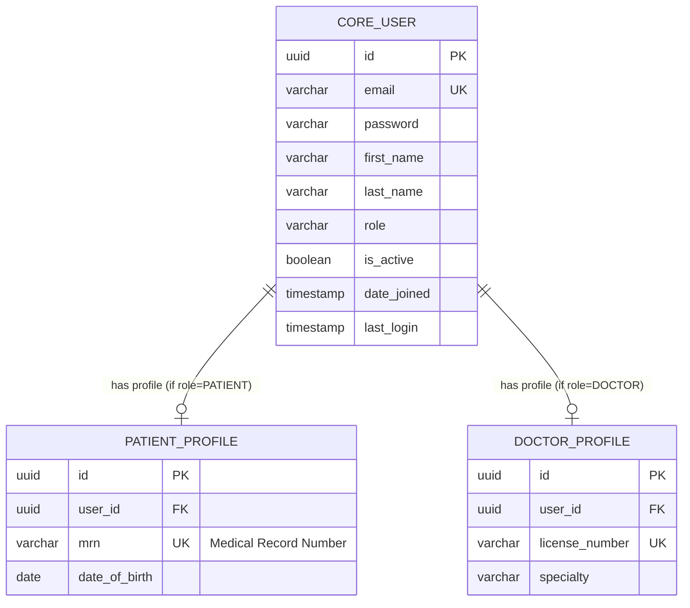

# Database Architecture Design

**Project:** AI Hospital Management System (AI-HMS)  
**Milestone:** 01 - Authentication & Authorization  
**Database:** PostgreSQL 15+  

---

## 1. User Entity Design
The `core_user` entity serves as the absolute source of truth for identity management across the entire AI-HMS ecosystem. It abstracts the authentication credentials away from clinical or operational profiles (which will be built in future milestones), ensuring a normalized and secure identity foundation.

| Column | Data Type | Modifiers | Description |
| :--- | :--- | :--- | :--- |
| `id` | `UUID` | Primary Key, Default: `uuid_generate_v4()` | Globally unique identifier. Avoids sequential IDs for security. |
| `email` | `VARCHAR(255)` | Unique, Not Null | The user's primary login credential. Normalized to lowercase. |
| `password` | `VARCHAR(128)` | Not Null | Hashed password string (bcrypt/Argon2). |
| `first_name` | `VARCHAR(150)` | Not Null | User's legal first name. |
| `last_name` | `VARCHAR(150)` | Not Null | User's legal last name. |
| `role` | `VARCHAR(20)` | Not Null | RBAC identifier. |
| `is_active` | `BOOLEAN` | Default: `true` | Soft-delete flag to suspend accounts without breaking foreign keys. |
| `date_joined`| `TIMESTAMP` | Default: `NOW()` | Audit trail for account creation. |
| `last_login` | `TIMESTAMP` | Nullable | Audit trail for most recent authentication event. |

## 2. Role Design
Roles are defined natively using a PostgreSQL `CHECK` constraint (Enum-like behavior) on the `role` column to ensure absolute data integrity at the database level.
Allowed values:
*   `ADMIN`
*   `DOCTOR`
*   `RECEPTIONIST`
*   `PATIENT`

## 3. Entity-Relationship Diagram (ERD)



## 4. Database Constraints
*   **Entity Integrity:** `id` utilizes UUIDv4 to prevent enumeration attacks and simplify distributed database sharding in the future.
*   **Domain Integrity:** The `email` column enforces a `UNIQUE` constraint to prevent duplicate registrations.
*   **Check Constraints:** `role IN ('ADMIN', 'DOCTOR', 'RECEPTIONIST', 'PATIENT')` prevents application layer bugs from inserting invalid access tiers.

## 5. Indexing Strategy
To optimize query performance for authentication flows:
1.  **Unique B-Tree Index on `email`**: Ensures $O(\log n)$ lookup times during login attempts. 
2.  **B-Tree Index on `role`**: Accelerates dashboard queries (e.g., "Select all Doctors").
3.  **Partial Index on `is_active`**: `CREATE INDEX idx_active_users ON core_user (is_active) WHERE is_active = true;` to speed up queries filtering for active personnel only.

## 6. Naming Conventions
*   **Tables:** `snake_case`, singular form, prefixed by the Django app name (e.g., `core_user`, `patient_profile`).
*   **Columns:** `snake_case` (e.g., `date_joined`, `last_name`).
*   **Primary Keys:** Always named `id`.
*   **Foreign Keys:** Suffix `_id` appended to the target table name (e.g., `user_id`).
*   **Indexes:** Prefixed with `idx_` followed by table and column (e.g., `idx_core_user_email`).

## 7. PostgreSQL Schema Design
*(Raw SQL Representation of the Django ORM Migration)*

```sql
CREATE EXTENSION IF NOT EXISTS "uuid-ossp";

CREATE TABLE core_user (
    id UUID PRIMARY KEY DEFAULT uuid_generate_v4(),
    email VARCHAR(255) UNIQUE NOT NULL,
    password VARCHAR(128) NOT NULL,
    first_name VARCHAR(150) NOT NULL,
    last_name VARCHAR(150) NOT NULL,
    role VARCHAR(20) NOT NULL CHECK (role IN ('ADMIN', 'DOCTOR', 'RECEPTIONIST', 'PATIENT')),
    is_active BOOLEAN NOT NULL DEFAULT TRUE,
    date_joined TIMESTAMP WITH TIME ZONE DEFAULT CURRENT_TIMESTAMP,
    last_login TIMESTAMP WITH TIME ZONE
);

CREATE UNIQUE INDEX idx_core_user_email ON core_user(email);
CREATE INDEX idx_core_user_role ON core_user(role);
```

## 8. Future Scalability Considerations
*   **Profile Decoupling:** By keeping the `core_user` table extremely lean (only authentication/authorization fields), we avoid vertical table bloat. Clinical data will live in a separate `patient_profile` table connected via a 1:1 foreign key.
*   **Audit Logging:** In future milestones (e.g., Milestone 5: Medical Records), a separate schema (e.g., `audit`) will be introduced using PostgreSQL Triggers to track every row-level mutation for HIPAA compliance.
*   **Connection Pooling:** As user concurrency grows, PgBouncer will be introduced between the Django API and PostgreSQL to manage transaction pools efficiently.
