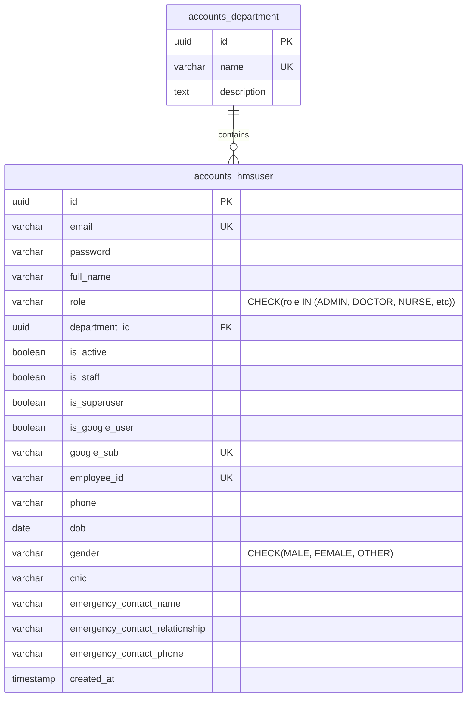

# Database Architecture Design: Identity & Custom User Schema

---
**Metadata**
- **Document Version:** 1.1 (Milestone 1 Completed)
- **Target Database:** PostgreSQL 15+
- **Status:** APPROVED
---

## 1. Relational Entities (Core Schema)

### 1.1 Table: `accounts_hmsuser`
The custom user table stores authentication identifiers, profile fields, session details, and Role-Based Access Control (RBAC) classifications. It overrides the default Django user schema, replacing the username field with a unique email address and utilizing globally unique identifiers (UUIDs) for primary keys. All core profile fields (demographics and emergency contact details) are stored directly inside the user table to facilitate rapid lookup and session initialization.

| Column Name | Data Type | Nullable | Default | Description / Constraints |
|:---|:---|:---:|:---|:---|
| **`id`** | `UUID` | NO | `uuid_generate_v4()` | Primary Key. Secure, non-sequential identifier. |
| **`email`** | `VARCHAR(254)` | NO | None | Unique constraint. Case-insensitive lookup key. |
| **`password`** | `VARCHAR(128)` | NO | None | Cryptographic PBKDF2/bcrypt password hash. |
| **`full_name`** | `VARCHAR(255)` | NO | None | User's legal full name. |
| **`role`** | `VARCHAR(20)` | NO | `'DOCTOR'` | Check constraint: `['ADMIN', 'DOCTOR', 'NURSE', 'RECEPTIONIST', 'PHARMACIST', 'LAB_TECHNICIAN', 'RADIOLOGIST', 'PATIENT']`. |
| **`department_id`** | `UUID` | YES | `NULL` | Foreign Key referencing `accounts_department(id)`. |
| **`is_active`** | `BOOLEAN` | NO | `FALSE` | Account status flag (activated instantly for patients, pending admin approval for staff). |
| **`is_staff`** | `BOOLEAN` | NO | `FALSE` | Grants entry privileges to Django Admin pages. |
| **`is_superuser`** | `BOOLEAN` | NO | `FALSE` | Grants complete administrative bypass permissions. |
| **`is_google_user`**| `BOOLEAN` | NO | `FALSE` | Indicates if the user authenticated via Google SSO. |
| **`google_sub`** | `VARCHAR(255)` | YES | `NULL` | Google OAuth Unique Subject ID. |
| **`employee_id`** | `VARCHAR(50)` | YES | `NULL` | Unique employee identifier for clinical/staff users. |
| **`phone`** | `VARCHAR(20)` | YES | `NULL` | Normalized Pakistani mobile number (`+923xxxxxxxxx`). |
| **`dob`** | `DATE` | YES | `NULL` | Patient Date of Birth. |
| **`gender`** | `VARCHAR(20)` | YES | `NULL` | Patient gender check constraint: `['MALE', 'FEMALE', 'OTHER']`. |
| **`cnic`** | `VARCHAR(20)` | YES | `NULL` | Patient CNIC (formatted as `XXXXX-XXXXXXX-X`). |
| **`emergency_contact_name`** | `VARCHAR(255)` | YES | `NULL` | Emergency contact full name. |
| **`emergency_contact_relationship`** | `VARCHAR(50)` | YES | `NULL` | Relationship check constraint: `['Father', 'Mother', 'Spouse', 'Sibling', 'Child', 'Other']`. |
| **`emergency_contact_phone`** | `VARCHAR(20)` | YES | `NULL` | Emergency contact phone (`+923xxxxxxxxx`). |
| **`created_at`** | `TIMESTAMP WITH TZ`| NO | `CURRENT_TIMESTAMP` | Account creation timestamp. |

---

## 2. Constraints & Database Rules

- **Entity Integrity:** The primary key `id` is a UUIDv4. This protects against horizontal scraping attacks (sequential ID guessing).
- **Check Constraints:** Enforces database-level validation to prevent unauthorized role writes:
  ```sql
  ALTER TABLE accounts_hmsuser
  ADD CONSTRAINT chk_role_choices
  CHECK (role IN ('ADMIN', 'DOCTOR', 'NURSE', 'RECEPTIONIST', 'PHARMACIST', 'LAB_TECHNICIAN', 'RADIOLOGIST', 'PATIENT'));
  ```
- **Gender Constraint:**
  ```sql
  ALTER TABLE accounts_hmsuser
  ADD CONSTRAINT chk_gender_choices
  CHECK (gender IN ('MALE', 'FEMALE', 'OTHER'));
  ```
- **Relationship Constraint:**
  ```sql
  ALTER TABLE accounts_hmsuser
  ADD CONSTRAINT chk_relationship_choices
  CHECK (emergency_contact_relationship IN ('Father', 'Mother', 'Spouse', 'Sibling', 'Child', 'Other'));
  ```

---

## 3. Indexing Strategy

To maintain rapid authorization validation and prevent lookup bottlenecks during concurrent request loads:

1. **Unique B-Tree Index on `email`:**
   - **Purpose:** Optimizes user lookup operations during login requests.
   - **SLA:** $O(\log n)$ search efficiency.
2. **Standard B-Tree Index on `role`:**
   - **Purpose:** Accelerates dashboard analytics and role filtering (e.g., listing doctor availability).
3. **Partial B-Tree Index on Active Status:**
   - **Purpose:** Speed up queries filtering for active clinical staff.
   - **SQL Code:**
     ```sql
     CREATE INDEX idx_active_users 
     ON accounts_hmsuser (is_active) 
     WHERE is_active = TRUE;
     ```

---

## 4. Entity-Relationship Diagram (ERD)

The ERD below illustrates the core identity user and its contextual link to departments.


